# 📘 Hướng dẫn Dự án: Chatbot vs ReAct Agent (VinWonders AI Assistant)

Tài liệu này cung cấp cái nhìn tổng quan về kiến trúc dự án, luồng xử lý (Workflow), chi tiết các lỗi đã sửa và cách thức vận hành hệ thống trợ lý ảo VinWonders Nam Hội An.

---

## 🎯 1. Tổng Quan Dự Án
Dự án được xây dựng như một ứng dụng mẫu cấp công nghiệp (production-grade prototype) để so sánh giữa hai mô hình tương tác AI:
* **Baseline Chatbot**: Trực tiếp gọi LLM không có công cụ bổ trợ, phụ thuộc vào tri thức huấn luyện sẵn có của mô hình (thường dẫn đến hiện tượng ảo tưởng thông tin hoặc từ chối trả lời).
* **ReAct Agent**: Một tác nhân thông minh triển khai vòng lặp suy luận **Thought -> Action -> Observation** có khả năng truy cập, tra cứu cơ sở dữ liệu thực tế của VinWonders để đưa ra câu trả lời chính xác 100%.

---

## 🔄 2. Luồng Xử Lý (Workflow) Của Hệ Thống

Dưới đây là sơ đồ luồng hoạt động chi tiết khi người dùng tương tác với hệ thống:

```mermaid
sequenceDiagram
    autonumber
    actor User as Người dùng (Web UI)
    participant API as FastAPI Backend (app.py)
    participant Agent as ReAct Agent (agent.py)
    participant LLM as LLM Provider (Gemini 2.5 Flash)
    participant Tool as Tool Database (vinwonders_tools.py)
    participant Telemetry as Telemetry & Logger (metrics.py)

    User->>API: Gửi câu hỏi (Ví dụ: "Bé cao 1m3 có được chơi...")
    API->>Telemetry: Ghi nhận sự kiện khởi chạy (AGENT_START)
    API->>Agent: Gọi hàm thực thi agent.run()
    
    rect rgb(30, 30, 46)
        note right of Agent: Bắt đầu vòng lặp ReAct Loop (Tối đa 5 bước)
        Agent->>LLM: Gửi Prompt (Yêu cầu phân tích bước tiếp theo)
        LLM-->>Agent: Trả về kết quả suy luận: Thought + Action (hoặc Final Answer)
        
        alt Trường hợp 1: LLM quyết định gọi Công cụ (Action)
            Agent->>Agent: Tách tên công cụ & tham số truyền vào
            Agent->>Tool: Thực thi công cụ tương ứng (Ví dụ: check_ride_eligibility)
            Tool-->>Agent: Trả về dữ liệu thực tế (Observation)
            Agent->>Telemetry: Ghi lại kết quả gọi công cụ (AGENT_STEP_COMPLETE)
            note right of Agent: Cập nhật Lịch sử suy luận: Thought + Action + Observation
        else Trường hợp 2: LLM đã đủ thông tin và đưa ra câu trả lời cuối cùng (Final Answer)
            note right of Agent: Kết thúc vòng lặp ReAct
        end
    end
    
    Agent-->>API: Trả về Final Answer + Toàn bộ tiến trình suy luận (Trace)
    API->>Telemetry: Tổng hợp hiệu suất: Số bước, Latency, Token và Chi phí (LLM_METRIC)
    API-->>User: Trả về câu trả lời hiển thị trên giao diện + Accordion tiến trình ReAct
```



---

## 🛠️ 3. Các Cải Tiến & Sửa Lỗi Đã Thực Hiện

Trong quá trình vận hành, em đã thực hiện hai cải tiến quan trọng giúp hệ thống hoạt động ổn định và có giao diện hiển thị chuyên nghiệp hơn:

### 1. Khắc Phục Lỗi Gọi LLM & Đồng Bộ Biến Môi Trường (`app.py`)
* **Lỗi gốc:** Khi người dùng gửi yêu cầu, API trả về lỗi `404 models/gemini-1.5-flash is not found for API version v1beta`. Do tài khoản API key hiện tại chỉ hỗ trợ các model thế hệ mới (ví dụ: `gemini-2.5-flash`), và Uvicorn giữ cache biến môi trường của hệ thống cũ khiến thay đổi trong tệp `.env` không được áp dụng khi tải lại trang.
* **Giải pháp:** Cập nhật lệnh nạp cấu hình trong [src/app.py](file:///d:/CongViec/AI/day3/Day-3-Lab-Chatbot-vs-react-agent/src/app.py) thành `load_dotenv(override=True)`. Điều này ép buộc Uvicorn ghi đè biến môi trường cũ ngay khi phát hiện thay đổi ở tệp `.env`, giúp kích hoạt mô hình `gemini-2.5-flash` thành công và chấm dứt lỗi 404.

### 2. Tối Ưu Hóa Giao Diện Sidebar & Sửa Lỗi Trùng Dẫm Lịch Sử (`index.css`)
* **Lỗi gốc:** 
  1. Khi danh sách lịch sử hội thoại dài ra, Flexbox mặc định co các phần tử con (`flex-shrink: 1`), khiến các khung hội thoại (`.history-item`) bị nén bẹt lại, đè chữ lên nhau.
  2. Không gian đệm dọc và ngang của thanh Sidebar quá rộng, làm cho phần chữ hiển thị tiêu đề bị cắt rất ngắn thành `Có những trò chơi nào trong ph...` dù thực tế thanh bên vẫn còn chỗ trống.
* **Giải pháp:** 
  * Thêm thuộc tính `flex-shrink: 0;` vào `.history-item` để bảo vệ chiều cao tự nhiên của phần tử, kích hoạt thanh cuộn dọc (scroll) mượt mà khi danh sách đầy.
  * Tối ưu lại toàn bộ cấu trúc khoảng đệm (Padding) của thanh bên (Header: `16px 18px`, Tabs: `10px 16px`, Section: `12px 14px`, Footer: `12px 14px`). Rút lề ngang từ `24px` xuống còn `14px` để tăng thêm **hơn 20px chiều rộng hiển thị thực tế** cho tiêu đề lịch sử, hiển thị được nhiều chữ nhất có thể.
  * Điều chỉnh font chữ tiêu đề về mức chuẩn **`13px`** và ngày tháng về **`10px`** giúp giao diện cân đối, rõ ràng và sang trọng.

---

## 🏃‍♂️ 4. Hướng Dẫn Vận Hành Hệ Thống

### 1. Khởi động Máy chủ API (FastAPI + Uvicorn)
Chạy lệnh sau tại thư mục gốc của dự án để khởi động ứng dụng:
```bash
python -m src.app
```
*Hệ thống sẽ chạy tại địa chỉ:* `http://127.0.0.1:8000`

### 2. Trải nghiệm & Đối sánh
1. **Truy cập Giao diện Web**: Mở trình duyệt và truy cập `http://127.0.0.1:8000`.
2. **Kiểm thử Baseline**: Chọn chế độ **Baseline Chat** ở thanh bên, hỏi các thông số phức tạp của công viên (ví dụ: Quy định chiều cao trò Cơn lốc sa mạc). Lưu ý cách mô hình tự "bịa" ra thông tin hoặc từ chối trả lời.
3. **Kiểm thử ReAct Agent**: Chuyển sang chế độ **ReAct Agent**, đặt câu hỏi tương tự. Nhấn vào phần **"Xem tiến trình suy luận (ReAct Steps)"** dưới câu trả lời của trợ lý ảo để xem chi tiết cách Agent lập luận, tự động gọi công cụ tra cứu dữ liệu thực tế và tổng hợp câu trả lời chính xác 100%.
4. **Giám sát Telemetry**: Chuyển sang tab **Dashboard** trên Sidebar để theo dõi biểu đồ số lần gọi công cụ, thời gian phản hồi trung bình, tỷ lệ thành công và chi phí tích lũy theo thời gian thực.

---
*Chúc anh có những trải nghiệm học tập và thực hành tuyệt vời với hệ thống Agentic AI này!*
